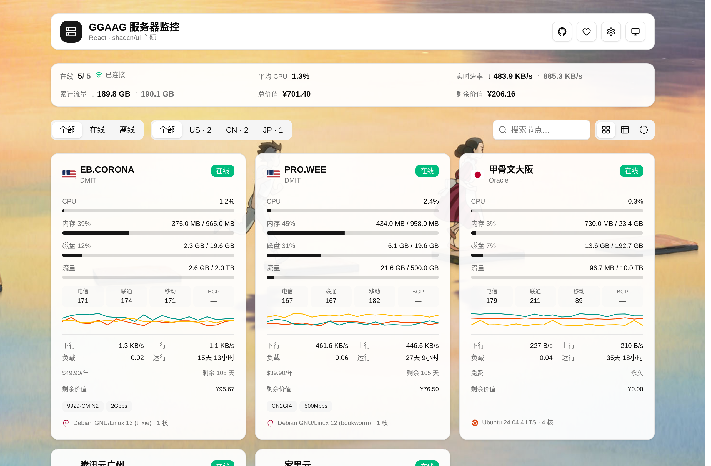

# cf-server-monitor-theme-shadcn

A **React + shadcn/ui** theme for [CF-Server-Monitor](https://github.com/huilang-me/CF-Server-Monitor).

CF 探针（CF-Server-Monitor）的 **React + shadcn/ui** 主题。社区主题多为 Vue 3 / reka-ui，这是少见的 React 实现。

> 状态：v1.0.0 · 可用。



## ✨ 功能

- **实时**：WebSocket 推送，连接状态三态（已连接 / 连接中 / 已断开）
- **视图**：卡片 / 表格 / 环形，切换记忆
- **指标**：CPU、内存、磁盘（数值 + 百分比）、负载、进程数、TCP/UDP、实时网速与累计流量
- **三网延迟**：电信 / 联通 / 移动 / BGP 当前值与走势（固定 4 行，无数据显示 —）
- **丢包率**：三网丢包历史曲线
- **历史**：1h / 6h / 24h / 7d（未登录时服务端限制 ≤24h，自动降级）
- **计费**：价格 / 周期 / 到期倒计时 / 自动续费 / 月度流量进度 / 标签
- **剩余价值**：按当日汇率统一折算人民币，汇总栏与每台卡片均显示（跳过「白嫖中」）
- **筛选**：地区分组、在线状态、搜索
- **外观**：浅色 / 深色 / 跟随系统（头部快捷切换）、GitHub / 爱发电按钮
- **加载态**：卡片 / 表格 / 详情 / 页脚统一骨架屏

## 🎛️ 外观与站点设置

主题**不带自己的设置面板**，外观走 CF-Server-Monitor 官方机制：

- **背景图**：后台「外观设置」的 `custom_bg` / `custom_bg_mobile`（外链需加入 `csp_static` 白名单，上传图转 `data:` 直接可用）。
- **站点默认**：后台 `theme_options`（`accent` 主色 / `cardStyle` 卡片样式 / `footer` 页脚 / `github`、`afdian` 页头社交按钮链接），主题读取后对全站生效；卡片固定 94% 不透明，无透明度滑块。
- **个人深浅色**：右上角按钮本地切换（`localStorage`，仅影响本机）。

## 🚀 安装

> 官方主题商店暂未上架，请用「自定义主题 URL」安装。

1. 打开 CF-Server-Monitor 后台（`/admin`）；
2. 进入 **主题商店 / 外观设置**，在「主题 URL」填入：
   ```
   https://github.com/LanHuangJG/cf-server-monitor-theme-shadcn/tree/build
   ```
3. 保存后刷新页面即可。

- 填 `build` 分支会**自动跟进**最新构建（分支缓存约 1 小时）；填具体 commit（40 位）可固定版本（缓存 24h）。
- 撤销：清空「主题 URL」。
- **在线预览**：https://status.ggaag.com
- **兼容性**：建议 CF-Server-Monitor **≥ 2.8.5**（用到 `theme_options`、`preferred_theme`、`latency_window` 等字段）。

> 想上架官方商店：按[主题开发文档](https://github.com/huilang-me/CF-Server-Monitor/blob/main/theme-develop.md)，把 `index.html` + `assets/` 提交到 [CFSM-Theme-Store](https://github.com/huilang-me/CFSM-Theme-Store)。本主题产物正好是 `index.html` + `assets/`，可直接提交。

## 🛠️ 本地开发

需要 Node.js 20+。

```bash
npm install
npm run dev
```

开发服务器把 `/api`、`/flags`、`/os-icons`（含 WebSocket）代理到后端，默认是作者的演示实例 `https://status.ggaag.com`；请用自己的实例覆盖：

```bash
VITE_API_TARGET=https://your-cfsm.example.com npm run dev
```

构建：

```bash
npm run build      # 产物输出到 dist/（index.html + assets/）
```

主分支 push 后，GitHub Actions 自动构建并把 `dist/` 发布到 `build` 分支，供 CF-Server-Monitor 反代。

## 🧱 技术栈

- React 19 + Vite + TypeScript
- Tailwind CSS v4 + [shadcn/ui](https://ui.shadcn.com/)
- 图表：Recharts（经 shadcn `ChartContainer` 封装）
- 路由：React Router（HashRouter，`/#/`、`/#/server/:id`）

## 📐 主题规范

遵循 [CF-Server-Monitor 主题开发文档](https://github.com/huilang-me/CF-Server-Monitor/blob/main/theme-develop.md)：

- 产物仅 `index.html` + `assets/`，资源用 `/assets/...`
- 旗帜 `/flags/<code>.svg`、系统图标 `/os-icons/<file>` 走默认皮肤，不打包
- 页脚展示 `Powered by CF-Server-Monitor` 与版本号
- 管理入口链接到 `/admin#admin`，不实现后台

## 🙏 参考

- [shadcn/ui](https://ui.shadcn.com/) — 设计体系与组件范式
- [Magic UI](https://magicui.design/) — NumberTicker 数字滚动（零依赖等价实现）
- 图表基于 [Recharts](https://recharts.org/) + shadcn `ChartContainer` 封装

## ☕ 支持

主题会持续维护。觉得好用，点个 Star / 提 issue 反馈就很好；有余力想请我喝杯咖啡也欢迎：

- 爱发电：https://afdian.com/a/wenjings
- 赞助者名单（自动更新）：[SPONSORS.md](SPONSORS.md)

（主题页头也内置了爱发电按钮，可通过 `theme_options.afdian` 配置。）

## 📄 License

MIT

## ⚠️ 免责声明

第三方主题，与 CF-Server-Monitor 官方无隶属关系。"shadcn" 指 shadcn/ui 设计体系，本主题为独立实现。
